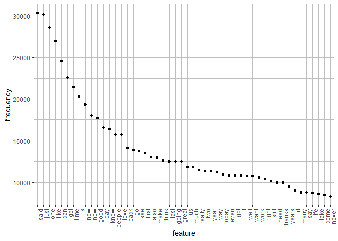
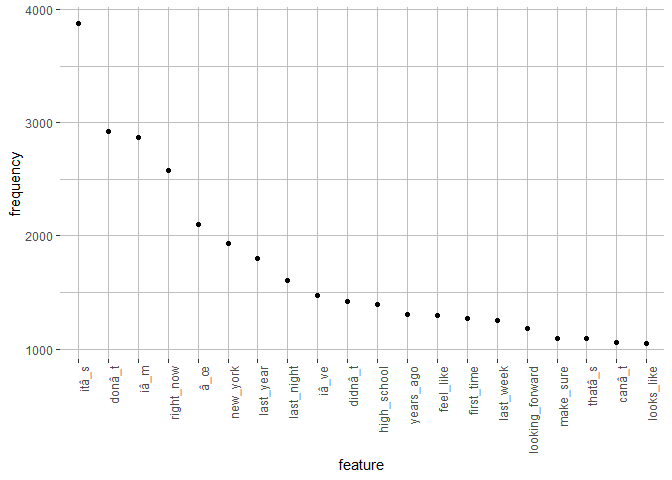
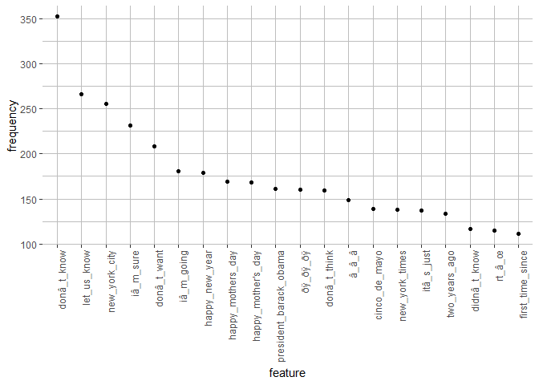

## Introduction

This report provides an introduction to the Capstone Project for the Data Science Specialization on [Coursera][1]. The overall goal of the project is to develop a word predictor. It will be deployed as a Shiny app and be accompanied by a Presentation that pitches the app. The project is done in partnership with [SwiftKey][2].

The goal of this report is to provide some exploratory analysis of the data.

To keep this report tidy and short, most of the code is not included. However, the code can easily be found and checked [here][3]!

## Loading the initial data

This part of the code downloads the data to the computer and unzips it. It checks if the data is already downloaded and unzipped. If the names of the original files are not changed, this process will only download the files once. Furthermore, the necessary packages are loaded.


```r
# Create a directory for the data
if(!file.exists("./Data")){
    dir.create("./Data")
}
# Download the data
URL <- "https://d396qusza40orc.cloudfront.net/dsscapstone/dataset/Coursera-SwiftKey.zip"
if(!file.exists("./Data/SwiftkeyData.zip")){
    download.file(URL, destfile = "./Data/SwiftkeyData.zip")
}
# Unzip the data
if(!file.exists("./Data/final")){
    unzip(zipfile = "./Data/SwiftkeyData.zip", exdir = "./Data")
}
dir("./Data/final/en_US")
```

```
[1] "en_US.blogs.txt"   "en_US.news.txt"    "en_US.twitter.txt"
```

```r
# Calculate the size of the files
sizeBlogs <- round(file.size("./Data/final/en_US/en_US.blogs.txt")/(10^6), 3)
sizeNews <- round(file.size("./Data/final/en_US/en_US.news.txt")/(10^6), 3)
sizeTwitter <- round(file.size("./Data/final/en_US/en_US.twitter.txt")/(10^6), 3)

library(readr); suppressPackageStartupMessages(library(quanteda)); library(ggplot2)
```

There are three files. They respectively hold texts about blogs, news, and tweets.
The size of the files is quite big. The data of the blogs is 210.16 MB.
The news-data is 205.812 MB. The twitter-data is 167.105 MB.
Because the files are this big, the files are sampled and a new (smaller) datafile is created.

## Creating a sample

To assure that this project is reproducible, the seed is set. Then, the samples are taken and combined into one new file. It is decided that about 10% of the data in the files is included in the sample. These are the first three entries in the sample.


```
[1] "Life is busy!"                               
[2] "Acts 9:7-8"                                  
[3] "How long did it take you to write your book?"
```


## Exploratory analysis

First, several characteristics of the original data and the sample are shown. These are the size, the length (how many entries), and the (estimated) total amount of words.


```
  DataSource    Size  Length    Words
1      Blogs 210.160  899288 38601602
2       News 205.812 1010242 35624468
3    Twitter 167.105 2360148 31105021
4     Sample  58.166  426968 10513499
```

For further analysis, the sample is cleaned. As the first three entries show, there are numbers, punctuation and capital letters. To create a good prediction model, these features need to be removed. Furthermore, the stopwords and several profanity words are also removed. The list of profanity words is [available][4], created by Shutterstock.
All the necessary transformations are made with the quanteda-package. You can find more about this package [here][5]. The list of stopwords is part of the quanteda-package.


To provide some exploratory statistics of the sample data, a Document-Feature Matrix is created. This plot shows the top-50 words in the sample data. It stands out that the words "*said*" and "*just*" appear the most in the data. 
<!-- -->

### Bigram

This plot shows the top-20 bigrams in the sample. the combinations "*right now*" and "*new york*" appear the most in the text.
<!-- -->

### Trigram

The following plot shows the top-20 trigrams in the sample. The combinations "*let us know*" and "*new york city*" appear the most in the sample.
<!-- -->

## Interesting Findings

The plots give an impression of the data. In general, they show that there is some further work to be done with cleaning the data. In the first plot, the 'word' "s" appears about 7000 times in the sample.
The plot of the trigram shows that the combinations "*happy mother's day*" and "*happy mothers day*" are both showing up. However, this should be put in one set.  

Furthermore, right now, the stopwords are removed from the sample, but stopwords are an important part of a language. Therefore, it is worth considering to not exclude these words.

## Next steps

The next step is to create a prediction algorithm. This algorithm should not only be based on the combination of words found in the data, but also take non-appearing combinations into account. This calls for an approach of **smoothing** or **discounting**. 


[1]: https://www.coursera.org/specializations/jhu-data-science "Coursera"
[2]: https://www.microsoft.com/en-us/swiftkey?rtc=1&activetab=pivot_1%3aprimaryr2 "SwiftKey"
[3]: https://github.com/kobe04/DataScienceCapstone "here"
[4]: https://github.com/LDNOOBW/List-of-Dirty-Naughty-Obscene-and-Otherwise-Bad-Words/blob/master/en "available"
[5]: https://quanteda.io/index.html "here"
